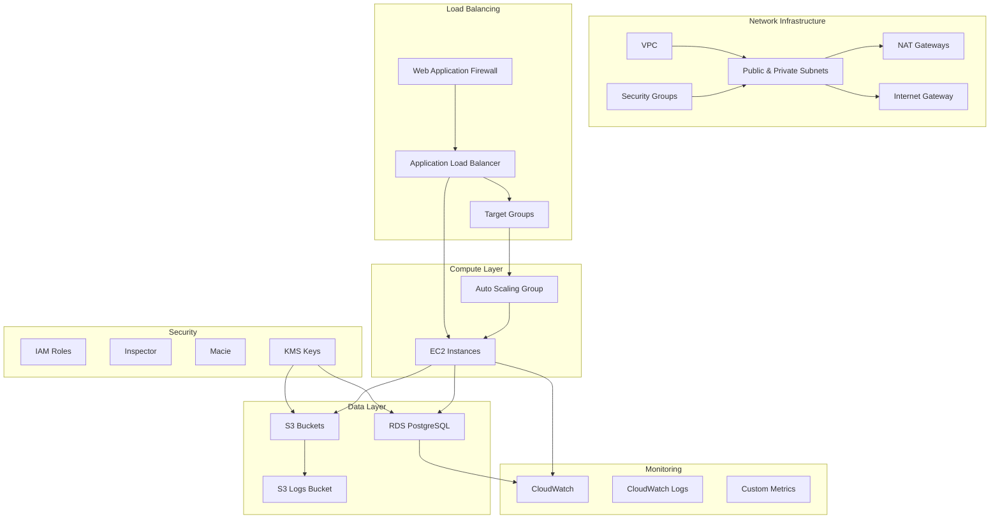

# Olechka AWS Environment - Terragrunt Project

This project contains a complete AWS environment infrastructure defined using Terragrunt and Terraform modules from the Terraform Registry.

## Resource Map



### Resource Configuration Matrix

| Component | Dev | Staging | Prod |
|-----------|-----|---------|------|
| **VPC Configuration** |
| CIDR Block | 10.0.0.0/16 | 172.16.0.0/16 | 192.168.0.0/16 |
| Availability Zones | 3 | 3 | 3 |
| NAT Gateways | 1 | 2 | 3 |
| VPC Flow Logs | Basic | Enhanced | Full |
| **Compute Resources** |
| Instance Type | t3.small | t3.large | m5.xlarge |
| Auto Scaling Min | 1 | 2 | 3 |
| Auto Scaling Max | 3 | 6 | 10 |
| **Database** |
| RDS Instance Class | db.t3.small | db.t3.large | db.r5.2xlarge |
| Multi-AZ | No | Yes | Yes |
| Backup Retention | 7 days | 14 days | 30 days |
| Performance Insights | 7 days | 14 days | 731 days |
| **Storage** |
| S3 Versioning | Enabled | Enabled | Enabled |
| S3 Lifecycle Rules | 30 days | 60 days | 90 days |
| S3 Replication | No | No | Yes |
## AWS Backend Resource Prerequisites

This project requires the following AWS resources for Terragrunt remote state and locking:

- **S3 Bucket**: `terragrunt-state-123456789012` (replace with your AWS Account ID)
- **DynamoDB Table**: `terragrunt-state-locks-123456789012` (replace with your AWS Account ID)

These must exist and be accessible by the CI/CD runner and any user running Terragrunt locally.

### Required IAM Permissions

The CI/CD runner and users must have the following IAM permissions:

- `s3:ListBucket`, `s3:GetObject`, `s3:PutObject`, `s3:DeleteObject` on the state bucket
- `dynamodb:GetItem`, `dynamodb:PutItem`, `dynamodb:DeleteItem`, `dynamodb:DescribeTable` on the lock table

For OIDC-based authentication, ensure the GitHub Actions role has these permissions attached.

See `.github/workflows/terragrunt.yml` for pre-flight resource checks.
| **Security** |
| WAF Rules | Basic | Enhanced | Advanced |
| SSL Policy | TLS-1-2 | TLS-1-2 | TLS-1-2-2021 |
| Network ACLs | Basic | Strict | Very Strict |
| GuardDuty | Enabled | Enabled | Enabled |
| **Monitoring** |
| CloudWatch Retention | 30 days | 90 days | 365 days |
| Metric Resolution | 5 min | 1 min | 1 min |
| Detailed Monitoring | No | Yes | Yes |

### Regional Deployment Status

| Region | Dev | Staging | Prod |
|--------|-----|---------|------|
| eu-west-1 | Deployed | Deployed | Deployed |
| eu-west-2 | Not deployed | Not deployed | Not deployed |

### Environment-Specific Features

#### Development (Dev)
- Cost-optimized infrastructure
- Basic monitoring and logging
- Simplified security rules
- Single NAT Gateway

#### Staging
- Production-like configuration
- Enhanced monitoring
- Strict security rules
- Dual NAT Gateways

#### Production (Prod)
- High-availability configuration
- Comprehensive monitoring
- Maximum security controls
- Triple NAT Gateways
- Cross-region backup
- Enhanced WAF protection

## Architecture Overview

The environment is designed as a multi-tier application with the following components:

### Core Infrastructure
- **VPC** with public and private subnets across 3 availability zones
- **NAT Gateways** for private subnet internet access
- **Security Groups** with least-privilege access rules
- **Application Load Balancer** for traffic distribution

### Application Layer
- **EC2 Instances** running Apache web servers
- **Auto Scaling Groups** for high availability
- **Target Groups** for load balancer health checks

### Data Layer
- **RDS PostgreSQL** database with encryption and monitoring
- **S3 Buckets** for application data and logs
- **Lifecycle Policies** for cost optimization

### Security & Compliance
- **WAF** with AWS managed rules
- **Inspector** for security assessments
- **Macie** for data discovery and protection
- **IAM Roles** with least privilege access
- **Encryption** at rest and in transit

## Project Structure

```
terragrunt-olechka/
├── common.hcl                           # Common variables and configuration
├── terragrunt.hcl                       # Root Terragrunt configuration
├── eu-west-1/                           # eu-west-1 region environment
│   ├── README.md                        # Environment-specific documentation
│   ├── deploy.sh                        # Bash deployment script
│   ├── deploy.ps1                       # PowerShell deployment script
│   ├── terragrunt.hcl                   # Environment root configuration
│   ├── _envcommon/                      # Common environment configuration
│   │   ├── provider.hcl                 # AWS provider configuration
│   │   └── versions.hcl                 # Terraform and provider versions
│   ├── network/                         # Networking components
│   │   ├── vpc/                         # VPC and subnets
│   │   ├── securitygroup/               # Security groups
│   │   └── elb/                         # Application Load Balancer
│   ├── compute/                         # Compute resources
│   │   └── ec2/                         # EC2 instances
│   ├── database/                        # Database resources
│   │   └── rds/                         # RDS PostgreSQL
│   ├── storage/                         # Storage resources
│   │   ├── s3/                          # Application data bucket
│   │   └── s3-logs/                     # Logs bucket
│   ├── iam/                             # Identity and Access Management
│   │   └── role/                        # IAM roles
│   └── security/                        # Security services
│       ├── waf/                         # Web Application Firewall
│       ├── inspector/                   # Security Inspector
│       └── macie/                       # Data discovery and protection
```

## Quick Start

### Prerequisites

1. **AWS CLI** configured with appropriate credentials
2. **Terragrunt** installed (version 0.84.0)
3. **Terraform** installed (version 1.13.0)
4. **AWS Account** with appropriate permissions
5. **Python 3.7+** (for Blast Radius integration)
6. **Docker** (optional, for containerized Blast Radius)

### Configuration

1. **Update AWS Account ID**: Edit `common.hcl` and replace `123456789012` with your actual AWS account ID.

2. **Create SSH Key Pair**: Create an SSH key pair named "olechka-key" in the AWS console.

3. **SSL Certificate**: Create or import an SSL certificate in AWS Certificate Manager and update the ARN in `eu-west-1/network/elb/terragrunt.hcl`.

### Deployment

#### Option 1: Using Deployment Scripts

**Linux/macOS:**
```bash
cd eu-west-1
chmod +x deploy.sh
./deploy.sh
```

**Windows:**
```powershell
cd eu-west-1
.\deploy.ps1
```

#### Option 2: Manual Deployment

```bash
# Navigate to the environment directory
cd eu-west-1

# Deploy all modules
terragrunt run-all apply

# Or deploy specific modules
cd network/vpc
terragrunt apply

cd ../compute/ec2
terragrunt apply
```

## Configuration Details

### Terraform Modules Used

All modules are sourced from the Terraform Registry for reliability and maintenance:

- **VPC**: `terraform-aws-modules/vpc/aws` (v5.8.1)
- **Security Groups**: `terraform-aws-modules/security-group/aws` (v5.1.2)
- **EC2**: `terraform-aws-modules/ec2-instance/aws` (v5.6.1)
- **RDS**: `terraform-aws-modules/rds/aws` (v6.6.0)
- **S3**: `terraform-aws-modules/s3-bucket/aws` (v4.1.2)
- **ALB**: `terraform-aws-modules/alb/aws` (v9.9.2)
- **WAF**: `terraform-aws-modules/waf/aws` (v1.0.0)
- **IAM**: `terraform-aws-modules/iam/aws` (v5.30.0)

### Provider Configuration

- **AWS Provider**: Version 6.2.0
- **Terraform**: Version 1.13.0
- **Region**: eu-west-1 (Ireland)

### Security Features

- **Encryption at Rest**: All storage and databases encrypted with AWS KMS
- **Encryption in Transit**: HTTPS/TLS for all web traffic
- **Network Security**: Private subnets with controlled internet access
- **Access Control**: IAM roles with least privilege principle
- **Web Protection**: WAF with AWS managed security rules
- **Security Monitoring**: Continuous security assessment with Inspector and Macie

## Monitoring and Logging

### CloudWatch Integration
- **Metrics**: Automatic collection for all AWS services
- **Logs**: Centralized logging for applications and infrastructure
- **Alarms**: Configurable alarms for critical metrics

### RDS Performance Insights
- **Database Monitoring**: Real-time database performance metrics
- **Query Analysis**: Slow query identification and optimization

### ALB Access Logs
- **Traffic Analysis**: Detailed request logs for load balancer
- **Security Monitoring**: Detection of suspicious traffic patterns

## Cost Optimization

### Resource Sizing
- **t3.micro instances**: Cost-effective for development and testing
- **db.t3.micro RDS**: Small database instances for non-production
- **S3 Lifecycle Policies**: Automatic data tiering to reduce costs

### Recommendations for Production
- **Reserved Instances**: Purchase reserved instances for predictable workloads
- **Auto Scaling**: Implement auto scaling based on demand
- **RDS Multi-AZ**: Enable multi-AZ for high availability
- **CloudFront**: Add CDN for global content delivery

## Troubleshooting

### Common Issues

1. **Certificate ARN Error**
   - Ensure SSL certificate exists in ACM
   - Verify certificate ARN in ALB configuration

2. **Key Pair Not Found**
   - Create SSH key pair named "olechka-key"
   - Ensure key pair exists in eu-west-1 region

3. **IAM Permissions**
   - Verify AWS credentials have sufficient permissions
   - Check CloudTrail for permission denied errors

4. **VPC Dependency Issues**
   - Deploy VPC first before other resources
   - Verify subnet configurations

### Debug Commands

```bash
# Check Terragrunt configuration
terragrunt validate-inputs

# View planned changes
terragrunt plan

# Check AWS credentials
aws sts get-caller-identity

# View CloudWatch logs
aws logs describe-log-groups
```

## Cleanup

To destroy the entire environment:

```bash
cd eu-west-1
terragrunt run-all destroy
```

**Warning**: This will permanently delete all resources and data.

## Blast Radius Integration

This repository includes integration with [Blast Radius](https://github.com/28mm/blast-radius) for interactive Terraform dependency visualization.

### Quick Start with Blast Radius

```bash
# Install dependencies
pip install -r requirements.txt

# Generate interactive diagrams
make blast-export

# Serve interactive diagrams
make blast-serve

# Use Docker (no local installation required)
make blast-docker-all
```

### Features

- **Interactive Visualizations**: Zoom, pan, search, and filter dependency graphs
- **Multiple Environments**: Support for dev, staging, prod, and eu-west-1 environments
- **Multiple Formats**: HTML, SVG, and PNG output formats
- **Docker Support**: Run without local dependencies
- **Web Interface**: Modern, responsive web interface

### Documentation

For detailed information about the Blast Radius integration, see:
- [Blast Radius Integration Guide](BLAST_RADIUS_INTEGRATION.md)
- [Interactive Diagrams](diagrams/) (generated after running `make blast-export`)

## Additional Resources

- [Terragrunt Documentation](https://terragrunt.gruntwork.io/)
- [Terraform AWS Provider](https://registry.terraform.io/providers/hashicorp/aws/latest/docs)
- [AWS Well-Architected Framework](https://aws.amazon.com/architecture/well-architected/)
- [AWS Security Best Practices](https://aws.amazon.com/security/security-learning/)
- [Blast Radius Documentation](https://github.com/28mm/blast-radius)

## Contributing

1. Fork the repository
2. Create a feature branch
3. Make your changes
4. Test thoroughly
5. Submit a pull request

## License

This project is licensed under the MIT License - see the LICENSE file for details.

## Support

For issues or questions:
1. Check the troubleshooting section above
2. Review AWS service documentation
3. Check CloudWatch logs and metrics
4. Verify IAM permissions and policies

---

**Note**: This infrastructure is designed for educational and development purposes. For production use, please review and adjust security configurations, resource sizing, and backup strategies according to your specific requirements.