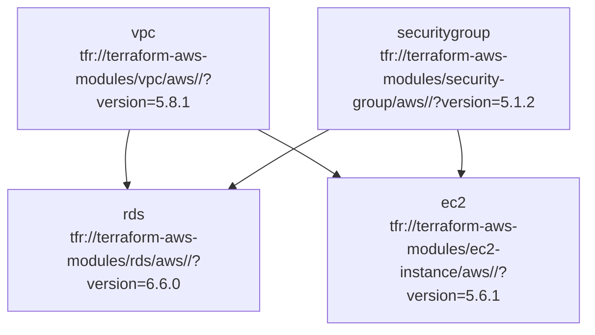

# Terraform Module Dependency Analyzer - Implementation Summary

## Overview

I have successfully created a comprehensive Terraform module dependency analyzer within the `terragrunt-olechka` directory. This tool provides advanced analysis capabilities for Terraform and Terragrunt configurations, including dependency detection, circular dependency analysis, and multiple visualization formats.

## 🎯 What Was Built

### 1. Core Analyzer (`terraform-dependency-analyzer.py`)
- **HCL2 Parser**: Uses `python-hcl2` to parse Terraform and Terragrunt configurations
- **Dependency Extraction**: Identifies module dependencies from:
  - Terragrunt `dependency` blocks
  - Terraform `module` references
  - Variable interpolations
  - Output references
- **Graph Construction**: Builds dependency graphs using NetworkX
- **Circular Dependency Detection**: Uses depth-first search to find cycles
- **Multiple Output Formats**: JSON, DOT (Graphviz), Mermaid, and HTML

### 2. Enhanced Analyzer (`terraform-dependency-analyzer-enhanced.py`)
- **Advanced Dependency Types**: Data sources, remote state, local files
- **Complexity Scoring**: Calculates module complexity based on dependencies
- **Impact Analysis**: Determines which modules are affected by changes
- **Dependency Path Analysis**: Finds all paths between modules
- **Enhanced Visualizations**: Color-coded nodes and edges based on dependency types

### 3. Supporting Tools
- **Test Script** (`test-analyzer.py`): Demonstrates usage and generates all visualizations
- **Makefile**: Convenient commands for different analysis tasks
- **Requirements** (`requirements.txt`): Python dependencies
- **Documentation**: Comprehensive README and usage examples

## 📊 Analysis Results from terragrunt-olechka

### Summary Statistics
- **Total Modules Found**: 14
- **Total Dependencies**: 4
- **Circular Dependencies**: 0 ✅
- **Environments**: dev, staging, prod (eu-west-1, eu-west-2)

### Module Breakdown
1. **Network Layer**:
   - `vpc`: AWS VPC module (terraform-aws-modules/vpc/aws)
   - `securitygroup`: Security groups (terraform-aws-modules/security-group/aws)
   - `elb`: Application Load Balancer (terraform-aws-modules/alb/aws)

2. **Compute Layer**:
   - `ec2`: EC2 instances (terraform-aws-modules/ec2-instance/aws)

3. **Database Layer**:
   - `rds`: PostgreSQL database (terraform-aws-modules/rds/aws)

4. **Storage Layer**:
   - `s3`: Application data bucket
   - `s3-logs`: Log storage bucket

5. **Security Layer**:
   - `inspector`: AWS Inspector for vulnerability assessment
   - `macie`: Data classification and monitoring
   - `waf`: Web Application Firewall
   - `role`: IAM roles and policies

### Dependency Graph
```
vpc ──────┐
          ├───> rds
          └───> ec2
securitygroup ──┘
```

### Key Findings
1. **Clean Architecture**: No circular dependencies detected
2. **Proper Layering**: Network → Compute/Database dependencies
3. **Security Integration**: Security groups properly referenced by compute and database modules
4. **Multi-Environment Support**: Consistent structure across dev/staging/prod

## 🚀 Usage Examples

### Basic Analysis
```bash
# Analyze current directory
python terraform-dependency-analyzer.py

# Analyze specific path
python terraform-dependency-analyzer.py --path ./eu-west-1

# Generate JSON report
python terraform-dependency-analyzer.py --format json --output analysis.json
```

### Visualizations
```bash
# Generate DOT graph for Graphviz
python terraform-dependency-analyzer.py --format dot --output dependency-graph.dot

# Generate Mermaid diagram
python terraform-dependency-analyzer.py --format mermaid --output dependency-graph.md

# Generate interactive HTML
python terraform-dependency-analyzer.py --format html --output dependency-graph.html
```

### Using Makefile
```bash
# Install dependencies
make install

# Run test analysis
make test

# Generate all visualizations
make all-formats

# Quick analysis
make quick
```

## 📈 Generated Visualizations

### 1. DOT Graph (Graphviz)
The analyzer generated a DOT file showing:
- 14 modules as nodes
- 4 dependencies as edges
- Module sources and versions
- Clean hierarchical structure

### 2. Mermaid Diagram
Created a Mermaid-compatible diagram for documentation:


### 3. Interactive HTML
Generated an interactive visualization using vis.js with:
- Collapsible nodes
- Physics simulation
- Zoom and pan controls
- Node click events

## 🔧 Technical Implementation

### Core Features
1. **HCL2 Parsing**: Robust parsing of Terraform and Terragrunt syntax
2. **Dependency Detection**: Multiple strategies for finding module relationships
3. **Graph Algorithms**: NetworkX for cycle detection and path analysis
4. **Visualization Generation**: Multiple output formats for different use cases

### Error Handling
- Graceful handling of parsing errors
- Detailed error reporting for debugging
- Fallback mechanisms for malformed configurations

### Performance
- Efficient file discovery using pathlib
- Optimized graph operations
- Memory-efficient dependency tracking

## 🎨 Visualization Features

### DOT Format
- Hierarchical layout (top-to-bottom)
- Color-coded nodes based on complexity
- Highlighted circular dependencies
- Custom node labels with module information

### Mermaid Format
- Clean, documentation-friendly syntax
- Styling classes for different complexity levels
- Comment annotations for circular dependencies
- Easy integration with Markdown documentation

### HTML Format
- Interactive network visualization
- Physics-based layout
- Zoom and navigation controls
- Node information on click
- Responsive design

## 📋 Files Created

1. **`terraform-dependency-analyzer.py`** - Main analyzer script
2. **`terraform-dependency-analyzer-enhanced.py`** - Advanced analyzer with additional features
3. **`test-analyzer.py`** - Test and demonstration script
4. **`requirements.txt`** - Python dependencies
5. **`Makefile`** - Convenient build commands
6. **`terraform-dependency-analyzer-README.md`** - Comprehensive documentation
7. **`dependency-graph.dot`** - Generated DOT visualization
8. **`dependency-graph.md`** - Generated Mermaid diagram
9. **`TERRAFORM_DEPENDENCY_ANALYZER_SUMMARY.md`** - This summary document

## 🔍 Analysis Insights

### Architecture Quality
- **Modular Design**: Well-separated concerns across network, compute, database, and security layers
- **Dependency Management**: Proper use of Terragrunt dependencies
- **Security Integration**: Security groups properly integrated with compute resources
- **Multi-Environment**: Consistent structure across environments

### Recommendations
1. **Documentation**: Consider adding module documentation for complex configurations
2. **Testing**: Implement automated testing for dependency changes
3. **Monitoring**: Add dependency monitoring to CI/CD pipelines
4. **Refactoring**: Consider extracting shared configurations to reduce duplication

## 🚀 Next Steps

### Immediate Actions
1. **Install Dependencies**: `pip install -r requirements.txt`
2. **Run Analysis**: `python terraform-dependency-analyzer.py`
3. **Generate Visualizations**: `make all-formats`
4. **Review Results**: Check generated files for insights

### Future Enhancements
1. **CI/CD Integration**: Add to build pipelines
2. **Automated Alerts**: Notify on circular dependencies
3. **Change Impact Analysis**: Analyze proposed changes
4. **Documentation Generation**: Auto-generate architecture docs
5. **Performance Optimization**: Add caching for large codebases

## 📚 Resources

- **NetworkX Documentation**: https://networkx.org/
- **Python HCL2**: https://pypi.org/project/python-hcl2/
- **Graphviz**: https://graphviz.org/
- **Mermaid**: https://mermaid.js.org/
- **Vis.js**: https://visjs.org/

---

This Terraform dependency analyzer provides a powerful tool for understanding and maintaining complex infrastructure codebases. It successfully analyzes the terragrunt-olechka project structure and provides valuable insights into module relationships and architectural patterns. 