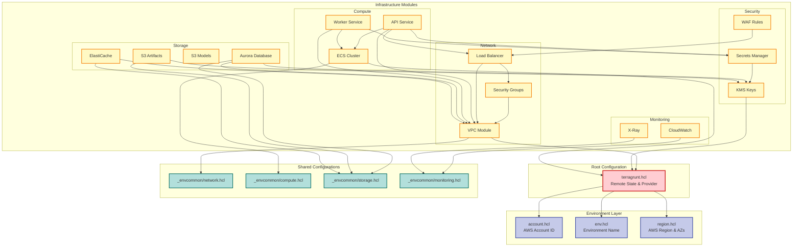
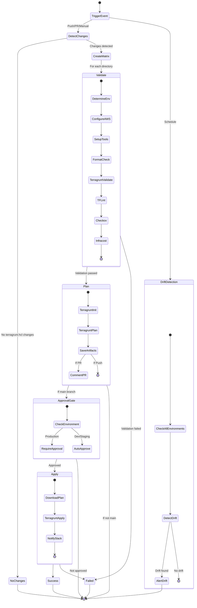

# Infrastructure and CI/CD Architecture Diagrams

## 1. AWS Infrastructure Architecture (Based on Terraform Plan)

```mermaid
graph TB
    subgraph "Multi-Region Architecture"
        subgraph "EU-CENTRAL-1 (Primary)"
            subgraph "Network Layer"
                VPC1[VPC<br/>10.0.0.0/16]
                IGW1[Internet Gateway]
                NAT1[NAT Gateway]

                subgraph "Subnets"
                    PUB1[Public Subnets<br/>10.0.101-103.0/24]
                    PRIV1[Private Subnets<br/>10.0.1-3.0/24]
                    DB1[Database Subnets<br/>10.0.201-203.0/24]
                    CACHE1[ElastiCache Subnets<br/>10.0.211-213.0/24]
                end

                VPCE1[VPC Endpoints<br/>S3, DynamoDB, ECS, etc.]
            end

            subgraph "Compute Layer"
                ALB1[Application Load Balancer]
                WAF1[AWS WAF]
                TG1[Target Groups<br/>API & Worker]
                ECS1[ECS Cluster<br/>Fargate]

                subgraph "ECS Services"
                    API1[API Service<br/>Auto-scaling 1-5]
                    WORKER1[Worker Service<br/>Auto-scaling 1-5]
                    XRAY1[X-Ray Daemon]
                end
            end

            subgraph "Storage Layer"
                AURORA1[Aurora PostgreSQL<br/>Multi-AZ]
                S3ART1[S3 Artifacts Bucket]
                S3MODEL1[S3 Models Bucket]
                REDIS1[ElastiCache Redis]
            end

            subgraph "Security Layer"
                KMS1[KMS Keys]
                SECRETS1[Secrets Manager]
                SG1[Security Groups]
            end

            subgraph "Monitoring"
                CW1[CloudWatch<br/>Logs & Metrics]
                XRAYMON1[X-Ray Tracing]
            end
        end

        subgraph "AP-SOUTHEAST-1 (Secondary)"
            VPC2[VPC<br/>10.1.0.0/16]
            AURORA2[Aurora Read Replica]
            S3REP[S3 Cross-Region<br/>Replication]
        end
    end

    subgraph "Global Services"
        R53[Route 53<br/>DNS]
        CF[CloudFront CDN]
        IAM[IAM Roles & Policies]
    end

    %% Connections
    R53 --> CF
    CF --> ALB1
    ALB1 --> WAF1
    WAF1 --> TG1
    TG1 --> API1
    TG1 --> WORKER1

    IGW1 --> PUB1
    PUB1 --> NAT1
    NAT1 --> PRIV1
    PRIV1 --> ECS1

    API1 --> AURORA1
    API1 --> REDIS1
    API1 --> S3ART1
    WORKER1 --> AURORA1
    WORKER1 --> S3MODEL1

    API1 --> SECRETS1
    SECRETS1 --> KMS1
    S3ART1 --> KMS1
    AURORA1 --> KMS1

    API1 --> CW1
    API1 --> XRAY1
    XRAY1 --> XRAYMON1

    AURORA1 -.->|Replication| AURORA2
    S3ART1 -.->|Cross-Region| S3REP

    VPC1 --> VPCE1

    classDef network fill:#e1f5fe,stroke:#01579b,stroke-width:2px
    classDef compute fill:#fff3e0,stroke:#e65100,stroke-width:2px
    classDef storage fill:#f3e5f5,stroke:#4a148c,stroke-width:2px
    classDef security fill:#fce4ec,stroke:#880e4f,stroke-width:2px
    classDef monitoring fill:#e8f5e9,stroke:#1b5e20,stroke-width:2px
    classDef global fill:#fffde7,stroke:#f57f17,stroke-width:2px

    class VPC1,VPC2,IGW1,NAT1,PUB1,PRIV1,DB1,CACHE1,VPCE1 network
    class ALB1,WAF1,TG1,ECS1,API1,WORKER1,XRAY1 compute
    class AURORA1,AURORA2,S3ART1,S3MODEL1,REDIS1,S3REP storage
    class KMS1,SECRETS1,SG1 security
    class CW1,XRAYMON1 monitoring
    class R53,CF,IAM global
```

## 2. CI/CD Pipeline Flow (GitHub Actions Workflow)

```mermaid
graph LR
    subgraph "Trigger Events"
        PUSH[Push to main/develop]
        PR[Pull Request]
        MANUAL[Manual Dispatch]
        SCHEDULE[Scheduled Drift Check]
    end

    subgraph "GitHub Actions Workflow"
        subgraph "Stage 1: Detection"
            DETECT[Detect Changes<br/>Find modified terragrunt.hcl]
            MATRIX[Generate Matrix<br/>Parallel job strategy]
        end

        subgraph "Stage 2: Validation"
            subgraph "Parallel Jobs per Directory"
                ENV[Determine Environment<br/>dev/staging/prod]
                AWS[Configure AWS Credentials<br/>OIDC Authentication]
                TOOLS[Setup Tools<br/>Terraform & Terragrunt]

                subgraph "Quality Checks"
                    FMT[Format Check<br/>terragrunt fmt]
                    VAL[Validate<br/>terragrunt validate]
                    LINT[TFLint<br/>Linting rules]
                    SEC[Checkov<br/>Security scanning]
                    COST[Infracost<br/>Cost estimation]
                end
            end
        end

        subgraph "Stage 3: Planning"
            INIT[Terragrunt Init]
            PLAN[Terragrunt Plan<br/>Generate tfplan]
            ARTIFACT[Upload Plan Artifacts]
            COMMENT[PR Comment<br/>Plan summary]
        end

        subgraph "Stage 4: Apply"
            GATE{Environment<br/>Approval}
            DOWNLOAD[Download Plan]
            APPLY[Terragrunt Apply<br/>Sequential execution]
            NOTIFY[Slack Notification]
        end

        subgraph "Stage 5: Drift Detection"
            DRIFT[Daily Drift Check<br/>All environments]
            ALERT[Alert on Drift]
        end
    end

    subgraph "AWS Infrastructure"
        S3BACKEND[S3 State Backend]
        DYNAMO[DynamoDB Lock Table]
        IAMROLE[GitHub Actions IAM Role<br/>OIDC Trust]
        TARGET[Target Infrastructure]
    end

    %% Connections
    PUSH --> DETECT
    PR --> DETECT
    MANUAL --> DETECT
    SCHEDULE --> DRIFT

    DETECT --> MATRIX
    MATRIX --> ENV
    ENV --> AWS
    AWS --> TOOLS
    TOOLS --> FMT
    FMT --> VAL
    VAL --> LINT
    LINT --> SEC
    SEC --> COST

    COST --> INIT
    INIT --> PLAN
    PLAN --> ARTIFACT
    ARTIFACT --> COMMENT

    COMMENT --> GATE
    GATE -->|Production| DOWNLOAD
    GATE -->|Dev/Staging| DOWNLOAD
    DOWNLOAD --> APPLY
    APPLY --> NOTIFY

    DRIFT --> ALERT

    AWS -.->|OIDC| IAMROLE
    INIT -.-> S3BACKEND
    PLAN -.-> DYNAMO
    APPLY -.-> TARGET

    classDef trigger fill:#ffebee,stroke:#c62828,stroke-width:2px
    classDef detection fill:#e3f2fd,stroke:#1565c0,stroke-width:2px
    classDef validation fill:#f3e5f5,stroke:#6a1b9a,stroke-width:2px
    classDef planning fill:#fff3e0,stroke:#ef6c00,stroke-width:2px
    classDef apply fill:#e8f5e9,stroke:#2e7d32,stroke-width:2px
    classDef aws fill:#fffde7,stroke:#f9a825,stroke-width:2px

    class PUSH,PR,MANUAL,SCHEDULE trigger
    class DETECT,MATRIX detection
    class ENV,AWS,TOOLS,FMT,VAL,LINT,SEC,COST validation
    class INIT,PLAN,ARTIFACT,COMMENT planning
    class GATE,DOWNLOAD,APPLY,NOTIFY apply
    class S3BACKEND,DYNAMO,IAMROLE,TARGET aws
```

## 3. Terragrunt Module Dependencies

## 4. GitHub Actions Workflow States

## 5. Environment Promotion Flow

```mermaid
graph LR
    subgraph "Development Workflow"
        DEV[Developer<br/>Local Changes]
        BRANCH[Feature Branch]
        PR[Pull Request]
    end

    subgraph "CI/CD Stages"
        subgraph "Dev Environment"
            DEVVAL[Validate]
            DEVPLAN[Plan]
            DEVAPPLY[Apply to Dev]
            DEVTEST[Smoke Tests]
        end

        subgraph "Staging Environment"
            STAGEVAL[Validate]
            STAGEPLAN[Plan]
            STAGEAPPLY[Apply to Staging]
            STAGETEST[Integration Tests]
        end

        subgraph "Production Environment"
            PRODVAL[Validate]
            PRODPLAN[Plan]
            PRODGATE[Manual Approval]
            PRODAPPLY[Apply to Production]
            PRODMON[Monitor & Alert]
        end
    end

    subgraph "Rollback Strategy"
        ROLLBACK[Rollback Plan]
        REVERT[Git Revert]
        REAPPLY[Re-apply Previous]
    end

    DEV --> BRANCH
    BRANCH --> PR
    PR --> DEVVAL
    DEVVAL --> DEVPLAN
    DEVPLAN --> DEVAPPLY
    DEVAPPLY --> DEVTEST

    DEVTEST -->|Success| STAGEVAL
    STAGEVAL --> STAGEPLAN
    STAGEPLAN --> STAGEAPPLY
    STAGEAPPLY --> STAGETEST

    STAGETEST -->|Success| PRODVAL
    PRODVAL --> PRODPLAN
    PRODPLAN --> PRODGATE
    PRODGATE -->|Approved| PRODAPPLY
    PRODAPPLY --> PRODMON

    PRODMON -->|Issues| ROLLBACK
    ROLLBACK --> REVERT
    REVERT --> REAPPLY

    classDef dev fill:#e3f2fd,stroke:#1565c0,stroke-width:2px
    classDef stage fill:#fff3e0,stroke:#ef6c00,stroke-width:2px
    classDef prod fill:#ffebee,stroke:#c62828,stroke-width:2px
    classDef rollback fill:#fce4ec,stroke:#ad1457,stroke-width:2px

    class DEVVAL,DEVPLAN,DEVAPPLY,DEVTEST dev
    class STAGEVAL,STAGEPLAN,STAGEAPPLY,STAGETEST stage
    class PRODVAL,PRODPLAN,PRODGATE,PRODAPPLY,PRODMON prod
    class ROLLBACK,REVERT,REAPPLY rollback
```

## Key Features Illustrated

### Infrastructure Architecture
- **Multi-region deployment** with primary in EU-CENTRAL-1 and secondary in AP-SOUTHEAST-1
- **Three-tier network architecture** with public, private, and database subnets
- **ECS Fargate** for serverless container orchestration
- **Aurora PostgreSQL** with cross-region read replicas
- **Comprehensive security** with KMS, Secrets Manager, and WAF
- **Full observability** with CloudWatch and X-Ray

### CI/CD Pipeline
- **OIDC authentication** with AWS (no static credentials)
- **Parallel validation** across multiple directories
- **Security scanning** with Checkov
- **Cost estimation** with Infracost
- **Environment-based approvals** (automatic for dev/staging, manual for production)
- **Drift detection** on schedule
- **Slack notifications** for deployment status

### Terragrunt Benefits
- **DRY configuration** with shared `_envcommon` files
- **Dependency management** between modules
- **Environment isolation** with separate state files
- **Mock outputs** for planning without dependencies

### Security & Compliance
- **OIDC federation** for GitHub Actions
- **Encryption at rest** with KMS
- **Secrets rotation** with Secrets Manager
- **Network isolation** with VPC and security groups
- **WAF protection** for web applications