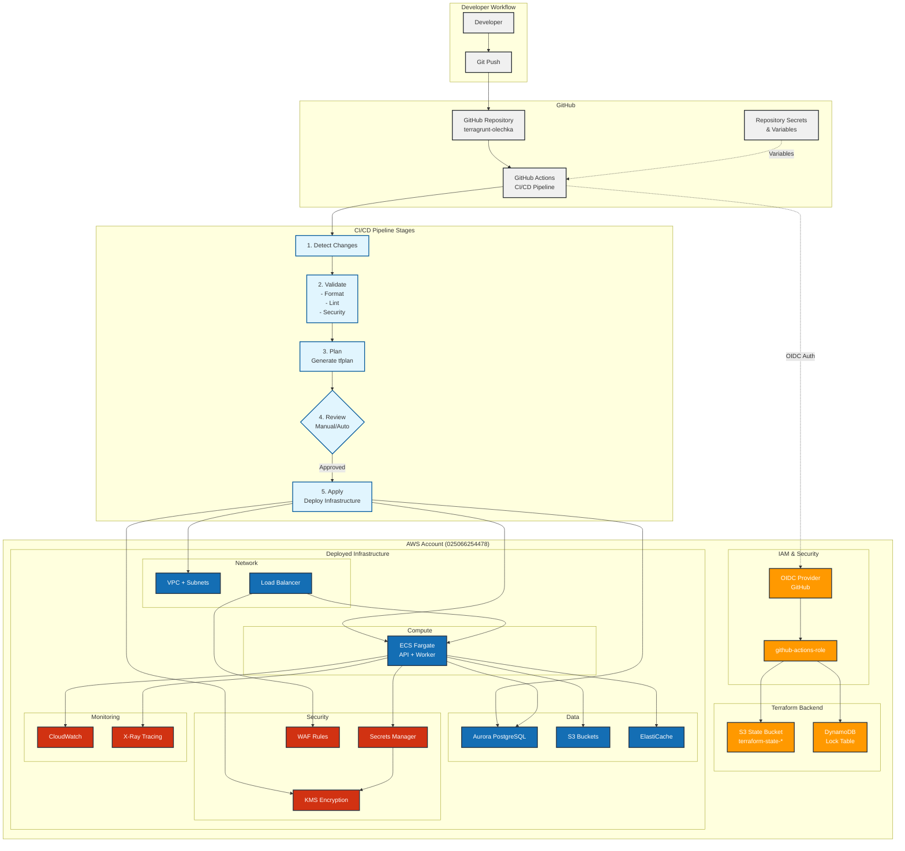
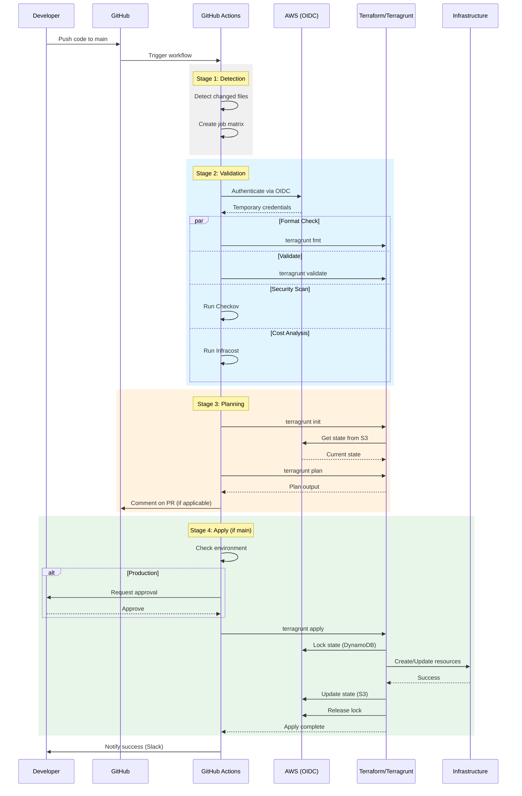
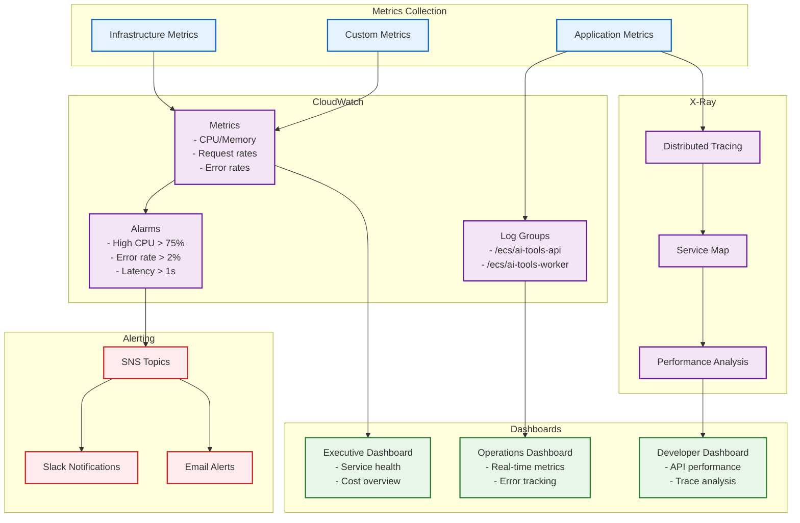

# Infrastructure Overview Diagram

## Complete System Architecture



## Workflow Execution Example



## Environment-Specific Configuration

```mermaid
graph LR
    subgraph "Configuration Hierarchy"
        ROOT[Root terragrunt.hcl<br/>- Backend config<br/>- Provider generation]

        subgraph "Environment Layer"
            DEV_CFG[dev/<br/>account.hcl<br/>env.hcl]
            STAGE_CFG[staging/<br/>account.hcl<br/>env.hcl]
            PROD_CFG[production/<br/>account.hcl<br/>env.hcl]
        end

        subgraph "Region Layer"
            EU[eu-central-1/<br/>region.hcl]
            AP[ap-southeast-1/<br/>region.hcl]
        end

        subgraph "Shared Configs"
            COMMON[_envcommon/<br/>- network.hcl<br/>- compute.hcl<br/>- storage.hcl<br/>- monitoring.hcl]
        end

        subgraph "Module Configs"
            MODULES[infrastructure modules<br/>vpc/terragrunt.hcl<br/>ecs/terragrunt.hcl<br/>etc...]
        end
    end

    ROOT --> DEV_CFG
    ROOT --> STAGE_CFG
    ROOT --> PROD_CFG

    DEV_CFG --> EU
    DEV_CFG --> AP

    EU --> MODULES
    AP --> MODULES

    COMMON --> MODULES

    subgraph "Resulting Infrastructure"
        subgraph "Dev Environment"
            DEV_INFRA[- Single NAT Gateway<br/>- Spot Instances<br/>- 7 day backups<br/>- Minimal HA]
        end

        subgraph "Staging Environment"
            STAGE_INFRA[- Multi-AZ NAT<br/>- On-demand instances<br/>- 14 day backups<br/>- Partial HA]
        end

        subgraph "Production Environment"
            PROD_INFRA[- Full HA (Multi-AZ)<br/>- Reserved instances<br/>- 30 day backups<br/>- Cross-region replication]
        end
    end

    MODULES --> DEV_INFRA
    MODULES --> STAGE_INFRA
    MODULES --> PROD_INFRA

    classDef config fill:#e8eaf6,stroke:#3f51b5,stroke-width:2px
    classDef env fill:#e0f2f1,stroke:#00695c,stroke-width:2px
    classDef result fill:#fff3e0,stroke:#e65100,stroke-width:2px

    class ROOT,COMMON,MODULES config
    class DEV_CFG,STAGE_CFG,PROD_CFG,EU,AP env
    class DEV_INFRA,STAGE_INFRA,PROD_INFRA result
```

## Key Metrics and Monitoring

