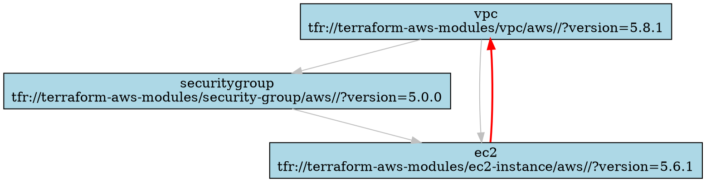
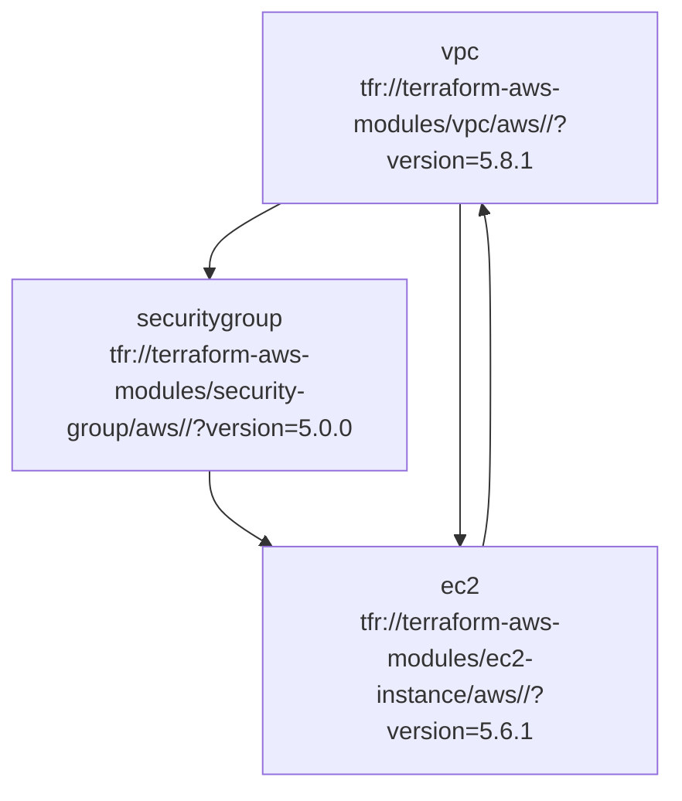

# Terraform Module Dependency Analyzer

A comprehensive tool for analyzing Terraform and Terragrunt module dependencies, detecting circular dependencies, and generating visualizations.

## Features

- 🔍 **Parse Terraform Configurations**: Uses `hcl2` to build AST from `.tf` and `terragrunt.hcl` files
- 📊 **Extract Module Dependencies**: Identifies module blocks, source attributes, and dependency relationships
- 🔗 **Build Dependency Graphs**: Creates comprehensive dependency graphs using NetworkX
- ⚠️ **Detect Circular Dependencies**: Uses depth-first search to find cycles in the dependency graph
- 🎯 **Generate Visualizations**: Creates multiple visualization formats:
  - **DOT format** for Graphviz
  - **Mermaid diagrams** for documentation
  - **Interactive HTML** with collapsible nodes using vis.js
- 💡 **Refactoring Suggestions**: Provides recommendations for breaking circular dependencies

## Installation

1. **Install Python dependencies**:
   ```bash
   pip install -r requirements.txt
   ```

2. **Make the script executable** (Linux/Mac):
   ```bash
   chmod +x terraform-dependency-analyzer.py
   ```

## Usage

### Basic Analysis

Analyze the current directory:
```bash
python terraform-dependency-analyzer.py
```

Analyze a specific path:
```bash
python terraform-dependency-analyzer.py --path ./eu-west-1
```

### Output Formats

#### JSON Output (Default)
```bash
python terraform-dependency-analyzer.py --format json --output analysis.json
```

#### DOT Graph (Graphviz)
```bash
python terraform-dependency-analyzer.py --format dot --output dependency-graph.dot
```

Generate PNG from DOT:
```bash
dot -Tpng dependency-graph.dot -o dependency-graph.png
```

#### Mermaid Diagram
```bash
python terraform-dependency-analyzer.py --format mermaid --output dependency-graph.md
```

#### Interactive HTML
```bash
python terraform-dependency-analyzer.py --format html --output dependency-graph.html
```

## Example Output

### Analysis Summary
```
📊 Analysis Summary:
  Total modules: 5
  Total dependencies: 8
  Circular dependencies: 1

⚠️  Circular Dependencies Detected:
  vpc -> securitygroup -> ec2 -> vpc
```

### JSON Output Structure
```json
{
  "modules": {
    "vpc": {
      "source": "tfr://terraform-aws-modules/vpc/aws//?version=5.8.1",
      "path": "eu-west-1/network/vpc",
      "dependencies": [],
      "terragrunt_dependencies": [],
      "variables": {...},
      "outputs": ["vpc_id", "private_subnets"]
    }
  },
  "circular_dependencies": [
    ["vpc", "securitygroup", "ec2", "vpc"]
  ],
  "total_modules": 5,
  "total_dependencies": 8,
  "refactoring_suggestions": [...]
}
```

### DOT Graph Example


### Mermaid Diagram Example


## How It Works

### 1. File Discovery
The analyzer recursively searches for:
- `terragrunt.hcl` files (Terragrunt configurations)
- `*.tf` files (Terraform configurations)

### 2. Parsing
- **Terragrunt files**: Extracts `dependency` blocks and `terraform.source`
- **Terraform files**: Extracts `module` blocks and their configurations
- **Variable references**: Identifies `module.name.output` references

### 3. Dependency Extraction
- **Direct dependencies**: From `dependency` blocks in Terragrunt
- **Variable dependencies**: From `module.name.output` references
- **Output dependencies**: From output values that reference other modules

### 4. Graph Construction
- Creates a directed graph using NetworkX
- Nodes represent modules
- Edges represent dependencies

### 5. Cycle Detection
- Uses NetworkX's `simple_cycles()` algorithm
- Identifies all circular dependency paths
- Provides detailed cycle information

### 6. Visualization Generation
- **DOT**: Standard Graphviz format
- **Mermaid**: Markdown-compatible diagrams
- **HTML**: Interactive visualization with vis.js

## Supported Terraform Patterns

### Terragrunt Dependencies
```hcl
dependency "vpc" {
  config_path = "../../network/vpc"
}

inputs = {
  subnet_id = dependency.vpc.outputs.private_subnets[0]
}
```

### Terraform Module References
```hcl
module "app" {
  source = "./modules/app"
  
  vpc_id = module.vpc.vpc_id
  subnet_ids = module.vpc.private_subnets
}
```

### Output References
```hcl
output "app_url" {
  value = module.app.application_url
}
```

## Refactoring Suggestions

When circular dependencies are detected, the analyzer provides suggestions:

1. **Extract Shared Logic**: Create a separate module for shared resources
2. **Use Data Sources**: Replace module outputs with data source lookups
3. **Restructure Dependencies**: Reorganize module hierarchy
4. **Use Remote State**: Reference outputs from remote state instead of direct module references

## Troubleshooting

### Common Issues

1. **HCL2 Parsing Errors**
   - Ensure Terraform files use HCL2 syntax
   - Check for syntax errors in configuration files

2. **Missing Dependencies**
   - Verify all referenced modules exist
   - Check file paths in dependency blocks

3. **Circular Dependencies**
   - Review the dependency chain
   - Consider using data sources or restructuring

### Debug Mode
Add debug output by modifying the script:
```python
import logging
logging.basicConfig(level=logging.DEBUG)
```

## Contributing

1. Fork the repository
2. Create a feature branch
3. Add tests for new functionality
4. Submit a pull request

## License

This tool is provided as-is for educational and development purposes. 