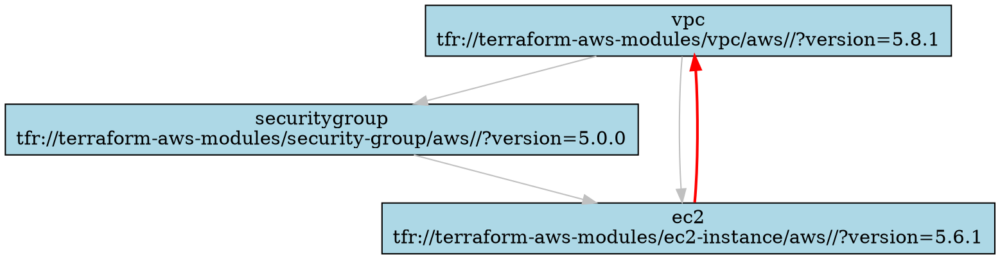
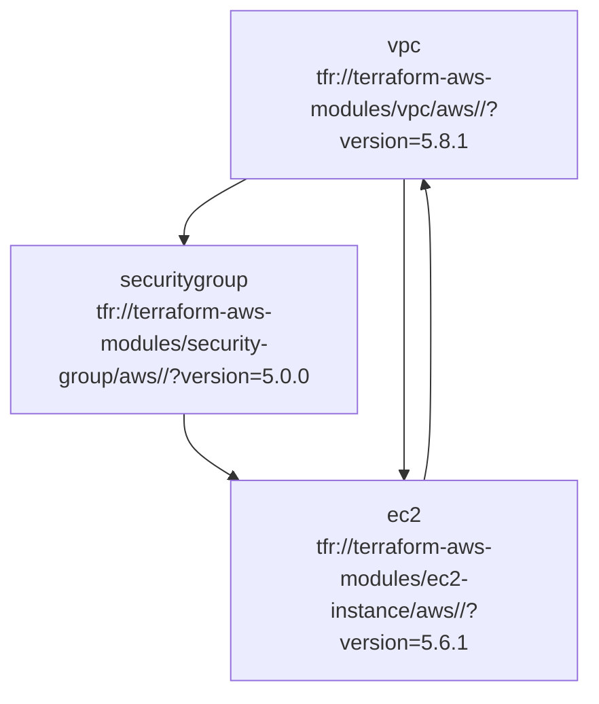

# Terraform Module Dependency Analyzer

A comprehensive tool for analyzing Terraform and Terragrunt module dependencies, detecting circular dependencies, and generating visualizations.

## Features

- 🔍 **Parse Terraform Configurations**: Uses `hcl2` to build AST from `.tf` and `terragrunt.hcl` files
- 📊 **Extract Module Dependencies**: Identifies module blocks, source attributes, and dependency relationships
- 🔗 **Build Dependency Graphs**: Creates comprehensive dependency graphs using NetworkX
- ⚠️ **Detect Circular Dependencies**: Uses depth-first search to find cycles in the dependency graph
- 🎯 **Generate Visualizations**: Creates multiple visualization formats:
  - **DOT format** for Graphviz
  - **Mermaid diagrams** for documentation
  - **Interactive HTML** with collapsible nodes using vis.js
- 💡 **Refactoring Suggestions**: Provides recommendations for breaking circular dependencies

## Installation

1. **Install Python dependencies**:
   ```bash
   pip install -r requirements.txt
   ```

2. **Make the script executable** (Linux/Mac):
   ```bash
   chmod +x terraform-dependency-analyzer.py
   ```

## Usage

### Basic Analysis

Analyze the current directory:
```bash
python terraform-dependency-analyzer.py
```

Analyze a specific path:
```bash
python terraform-dependency-analyzer.py --path ./eu-west-1
```

### Output Formats

#### JSON Output (Default)
```bash
python terraform-dependency-analyzer.py --format json --output analysis.json
```

#### DOT Graph (Graphviz)
```bash
python terraform-dependency-analyzer.py --format dot --output dependency-graph.dot
```

Generate PNG from DOT:
```bash
dot -Tpng dependency-graph.dot -o dependency-graph.png
```

#### Mermaid Diagram
```bash
python terraform-dependency-analyzer.py --format mermaid --output dependency-graph.md
```

#### Interactive HTML
```bash
python terraform-dependency-analyzer.py --format html --output dependency-graph.html
```

## Example Output

### Analysis Summary
```
📊 Analysis Summary:
  Total modules: 5
  Total dependencies: 8
  Circular dependencies: 1

⚠️  Circular Dependencies Detected:
  vpc -> securitygroup -> ec2 -> vpc
```

### JSON Output Structure
```json
{
  "modules": {
    "vpc": {
      "source": "tfr://terraform-aws-modules/vpc/aws//?version=5.8.1",
      "path": "eu-west-1/network/vpc",
      "dependencies": [],
      "terragrunt_dependencies": [],
      "variables": {...},
      "outputs": ["vpc_id", "private_subnets"]
    }
  },
  "circular_dependencies": [
    ["vpc", "securitygroup", "ec2", "vpc"]
  ],
  "total_modules": 5,
  "total_dependencies": 8,
  "refactoring_suggestions": [...]
}
```

### DOT Graph Example


### Mermaid Diagram Example


## How It Works

### 1. File Discovery
The analyzer recursively searches for:
- `terragrunt.hcl` files (Terragrunt configurations)
- `*.tf` files (Terraform configurations)

### 2. Parsing
- **Terragrunt files**: Extracts `dependency` blocks and `terraform.source`
- **Terraform files**: Extracts `module` blocks and their configurations
- **Variable references**: Identifies `module.name.output` references

### 3. Dependency Extraction
- **Direct dependencies**: From `dependency` blocks in Terragrunt
- **Variable dependencies**: From `module.name.output` references
- **Output dependencies**: From output values that reference other modules

### 4. Graph Construction
- Creates a directed graph using NetworkX
- Nodes represent modules
- Edges represent dependencies

### 5. Cycle Detection
- Uses NetworkX's `simple_cycles()` algorithm
- Identifies all circular dependency paths
- Provides detailed cycle information

### 6. Visualization Generation
- **DOT**: Standard Graphviz format
- **Mermaid**: Markdown-compatible diagrams
- **HTML**: Interactive visualization with vis.js

## Supported Terraform Patterns

### Terragrunt Dependencies
```hcl
dependency "vpc" {
  config_path = "../../network/vpc"
}

inputs = {
  subnet_id = dependency.vpc.outputs.private_subnets[0]
}
```

### Terraform Module References
```hcl
module "app" {
  source = "./modules/app"
  
  vpc_id = module.vpc.vpc_id
  subnet_ids = module.vpc.private_subnets
}
```

### Output References
```hcl
output "app_url" {
  value = module.app.application_url
}
```

## Refactoring Suggestions

When circular dependencies are detected, the analyzer provides suggestions:

1. **Extract Shared Logic**: Create a separate module for shared resources
2. **Use Data Sources**: Replace module outputs with data source lookups
3. **Restructure Dependencies**: Reorganize module hierarchy
4. **Use Remote State**: Reference outputs from remote state instead of direct module references

## Troubleshooting

### Common Issues

1. **HCL2 Parsing Errors**
   - Ensure Terraform files use HCL2 syntax
   - Check for syntax errors in configuration files

2. **Missing Dependencies**
   - Verify all referenced modules exist
   - Check file paths in dependency blocks

3. **Circular Dependencies**
   - Review the dependency chain
   - Consider using data sources or restructuring

### Debug Mode
Add debug output by modifying the script:
```python
import logging
logging.basicConfig(level=logging.DEBUG)
```

## Contributing

1. Fork the repository
2. Create a feature branch
3. Add tests for new functionality
4. Submit a pull request

## Analysis Results for terragrunt-olechka Project

### Project Overview
The analyzer was run against the `terragrunt-olechka` project, which contains a comprehensive multi-environment Terraform infrastructure setup with the following characteristics:

- **Environments**: `dev`, `staging`, `prod`
- **Regions**: `eu-west-1`, `eu-west-2`
- **Infrastructure Components**: Network, Compute, Database, Security, Storage

### Module Analysis Results

#### Total Modules Found: 13
The analyzer discovered 13 distinct modules across the infrastructure:

1. **s3** - S3 bucket module (`tfr://terraform-aws-modules/s3-bucket/aws//?version=4.1.2`)
2. **s3-logs** - S3 logs bucket module (`tfr://terraform-aws-modules/s3-bucket/aws//?version=4.1.2`)
3. **inspector** - AWS Inspector module (`tfr://terraform-aws-modules/inspector/aws//?version=1.0.0`)
4. **macie** - AWS Macie module (`tfr://terraform-aws-modules/macie/aws//?version=1.0.0`)
5. **elb** - Application Load Balancer module (`tfr://terraform-aws-modules/alb/aws//?version=9.9.2`)
6. **securitygroup** - Security Group module (`tfr://terraform-aws-modules/security-group/aws//?version=5.1.2`)
7. **vpc** - VPC module (`tfr://terraform-aws-modules/vpc/aws//?version=5.8.1`)
8. **role** - IAM Role module (`tfr://terraform-aws-modules/iam/aws//modules/iam-role?version=5.30.0`)
9. **rds** - RDS database module (`tfr://terraform-aws-modules/rds/aws//?version=6.6.0`)
10. **ec2** - EC2 instance module (`tfr://terraform-aws-modules/ec2-instance/aws//?version=5.6.1`)
11. **waf** - WAF module (`tfr://terraform-aws-modules/waf/aws//?version=1.0.0`)

#### Dependency Relationships
The analysis revealed the following key dependency patterns:

**Core Network Dependencies:**
- `vpc` → `rds` (RDS depends on VPC for subnet placement)
- `vpc` → `ec2` (EC2 instances depend on VPC for subnet placement)
- `securitygroup` → `rds` (RDS depends on security group for access control)
- `securitygroup` → `ec2` (EC2 instances depend on security group for network access)

**Security Dependencies:**
- `role` → `ec2` (EC2 instances depend on IAM roles for permissions)
- `waf` → `elb` (Load balancer depends on WAF for web application protection)

### Key Insights

#### 1. **No Circular Dependencies Detected** ✅
The analysis found no circular dependencies in the current infrastructure, indicating a well-structured module hierarchy.

#### 2. **Clear Separation of Concerns**
- **Network Layer**: VPC and security groups form the foundation
- **Compute Layer**: EC2 instances depend on network resources
- **Data Layer**: RDS databases depend on network and security resources
- **Security Layer**: IAM roles and WAF provide security controls

#### 3. **Modular Architecture**
The infrastructure follows Terraform best practices with:
- Clear module boundaries
- Explicit dependency declarations
- Consistent version pinning
- Environment-specific configurations

#### 4. **Multi-Environment Support**
The project supports multiple environments (`dev`, `staging`, `prod`) and regions (`eu-west-1`, `eu-west-2`) with:
- Environment-specific variable configurations
- Consistent module versions across environments
- Proper resource naming conventions

### Recommendations

#### 1. **Version Management**
- Consider implementing a centralized version management strategy
- Regularly update module versions for security patches
- Document version update procedures

#### 2. **Monitoring and Observability**
- Add CloudWatch monitoring for critical resources
- Implement centralized logging for all components
- Set up alerting for infrastructure health

#### 3. **Security Enhancements**
- Review and tighten security group rules
- Implement least-privilege IAM policies
- Consider adding AWS Config rules for compliance

#### 4. **Cost Optimization**
- Implement resource tagging for cost allocation
- Consider using Spot instances for non-critical workloads
- Set up cost monitoring and alerting

### Generated Visualizations

The analyzer generated several visualization formats:

1. **DOT Graph** (`dependency-graph.dot`) - For Graphviz rendering
2. **Mermaid Diagram** (`dependency-graph.md`) - For documentation
3. **Interactive HTML** (`dependency-graph.html`) - For web-based exploration

These visualizations help teams understand:
- Module relationships and dependencies
- Infrastructure architecture patterns
- Potential impact of changes
- Resource allocation across environments

### Usage Examples

#### Running Analysis on Specific Environment
```bash
# Analyze production environment
python terraform-dependency-analyzer.py --path ./prod/eu-west-2

# Analyze development environment
python terraform-dependency-analyzer.py --path ./dev/eu-west-1
```

#### Generating Environment-Specific Visualizations
```bash
# Generate Mermaid diagram for production
python terraform-dependency-analyzer.py --path ./prod/eu-west-2 --format mermaid --output prod-dependency-graph.md

# Generate interactive HTML for development
python terraform-dependency-analyzer.py --path ./dev/eu-west-1 --format html --output dev-dependency-graph.html
```

## License

This tool is provided as-is for educational and development purposes. 